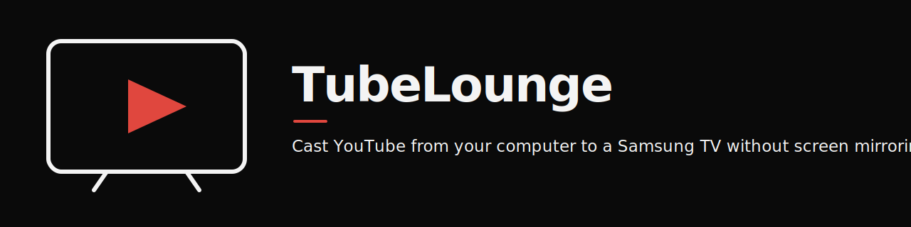
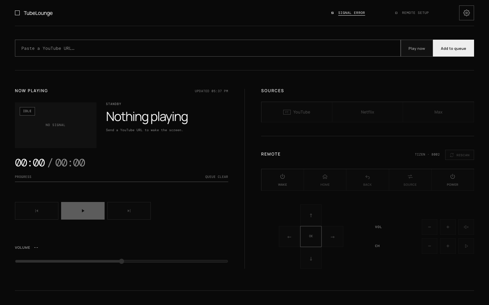

<p align="center">
  
</p>

<p align="center">
  <strong>Send YouTube from your computer to a Samsung TV without screen sharing your whole desktop.</strong>
</p>

<p align="center">
  <a href="LICENSE"></a>
  
  
  
</p>

<p align="center">
  <a href="#install--run">Install</a> ·
  <a href="#chrome-extension">Chrome extension</a> ·
  <a href="#samsung-wi-fi-remote">TV remote</a> ·
  <a href="#how-it-works--caveats">How it works</a>
</p>

<p align="center">
  
</p>

> [!NOTE]
> Your computer and the TV must be on the same local network. The TV may ask you to approve TubeLounge on screen the first time you connect.

TubeLounge is a single user FastAPI app that talks to a paired Samsung YouTube TV session through the private YouTube Lounge API. Instead of mirroring your screen, it tells the TV's own YouTube app which video to play, so the TV streams straight from YouTube in full quality while your laptop just acts as the remote. You get play controls, a queue mirror, history, and a separate Tizen remote panel for power, volume, and app launching. A small Chrome extension can push YouTube links into the TV queue from the browser.

**No screen mirroring.** Your desktop, notifications, and other tabs stay private. Only the video ID crosses the network; the TV does the streaming.

## Features

- Cast YouTube to the TV without screen mirroring; the TV streams from YouTube, your desktop stays private
- Local web UI for transport control: play/pause, previous/next, seek, volume, play now, queue add, and queue removal
- Live now playing state with progress, history, and an app side queue mirror
- Queue removal rebuilds the mirrored TV playlist while preserving playback position
- Samsung Tizen remote over the TV's local WebSocket API: dpad, home, back, source, power on/off, volume, channel, mute, play/pause, and app launchers (YouTube, Netflix, Max)
- Wake on LAN for power on
- Chrome MV3 extension: right click a YouTube link or page and choose **Add to TV queue**
- First run onboarding and a TV setup panel for IP and MAC

## Requirements

- Python and [uv](https://github.com/astral-sh/uv)
- Node.js (for the static JS check step only)
- A Samsung Tizen TV on the same LAN
- A browser
- `ytcast` for one time YouTube pairing (`ytcast -pair`)

## Install / Run

Pair the TV once using the code shown in the YouTube TV app:

```
ytcast -pair "TV-CODE"
```

The server reuses the pairing in `~/.cache/ytcast/ytcast.json`. Set `TVCC_AUTH_PATH=/path/to/ytcast.json` if your cache lives elsewhere.

```
cd tubelounge
uv run --with-requirements requirements.txt uvicorn app:app --host 127.0.0.1 --port 8765
```

Open http://127.0.0.1:8765.

> **Security:** Keep the server bound to `127.0.0.1`. It intentionally has no login because it is a single user local remote; any process that can reach it can control the TV. Do not expose it on `0.0.0.0` or forward port `8765` to another machine.

Python deps (via `requirements.txt` / uv): `fastapi`, `pyytlounge==2.3.0`, `samsungtvws==3.0.5`, `uvicorn`, `websockets`.

## Samsung Wi-Fi remote

The remote panel controls a modern Samsung Tizen TV directly over its local WebSocket API. Open TV setup, enter the TV's IP and Wi-Fi MAC, save, then choose Test / approve. Settings are stored outside the repository at `~/.config/tv-command-center/samsung.json`.

Environment variables are also supported for unattended installs:

```
SAMSUNG_TV_IP=192.168.1.50 \
SAMSUNG_TV_MAC=aa:bb:cc:dd:ee:ff \
uv run --with-requirements requirements.txt uvicorn app:app --host 127.0.0.1 --port 8765
```

The first button press may show an approval prompt on the TV. Accept it once; the token is saved outside the repository at `~/.cache/tv-command-center/samsung-token.txt`. Wake uses Wake on LAN; the other buttons use Samsung's TLS WebSocket API on port `8002`. Both devices must be on the same LAN.

YouTube, Netflix, and Max launcher buttons use their current Samsung app IDs. Samsung notes that IDs can vary by TV year and firmware, so a button can fail if that app is not installed or uses a different regional ID.

## Chrome extension

1. Open `chrome://extensions`.
2. Enable Developer mode.
3. Click **Load unpacked** and choose the `extension` folder in this repo.
4. Right click a YouTube link or page and choose **Add to TV queue**.

The local server must be running on port `8765`. The extension POSTs to that server.

## Development / Checks

```
uv run --with-requirements requirements.txt --with pytest --with httpx python -m pytest -q
node --check static/app.js
node --check extension/background.js
python3 -m json.tool extension/manifest.json >/dev/null
```

## How it works / Caveats

- **YouTube path:** the UI drives the paired YouTube TV app through the private Lounge API (`pyytlounge`). Transport and queue operations go through that session; the app keeps a best effort mirror of the queue because Lounge does not expose the full playlist.
- **Samsung path:** the remote panel talks to the TV's local WebSocket API on port `8002` (TLS) via `samsungtvws`, with Wake on LAN for power on.
- **Pairing:** a missing, expired, or invalid ytcast cache produces a pairing error. Link the TV again with `ytcast -pair`.

YouTube Lounge is private and unversioned. If Google changes it, the UI will surface the failure instead of crashing.

Not affiliated with Google, Samsung, or YouTube.

## License

MIT. See [LICENSE](LICENSE).

Repo: https://github.com/cdbkk/tubelounge
